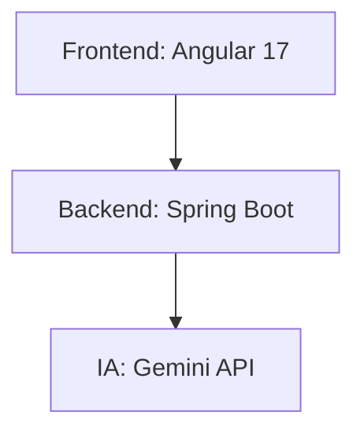

# 🚀 **InstantMail - Sua IA para Respostas de E-mail Perfeitas**

<div align="center">
  
</div>


**InstantMail** é uma ferramenta  que utiliza inteligência artificial para ajudar você a redigir respostas de e-mail de forma rápida e eficiente. Com suporte a múltiplos tons de comunicação, o InstantMail se adapta ao seu estilo de escrita, seja profissional, casual ou amigável

🌐 **Acesse agora:** [InstantMail Official](https://www.instantmail.shop/)
<div align="center">
  
## ✨ **Recursos Exclusivos**

| 🔥 **Geração Instantânea** | 🎭 **Multi-Tons** | 🌈 **Integrações** |
|---------------------------|------------------|-------------------|
| Respostas em <5 segundos | Profissional/Casual/Amigável | Extensão Chrome (em breve) |

</div>

## 🛠 **Tecnologias Principais**



## 🚀 **Comece Agora**

### 🌐 **Versão Online (Recomendada)**
Acesse instantamente:  
[](https://www.instantmail.shop/)

### 💻 **Execução Local**
```bash
# 1. Clone o repositório
git clone https://github.com/JamesonHenrique/InstantMail.git

# 2. Configure o .env
echo "GEMINI_API_KEY=sua_chave" > .env

# 3. Inicie os serviços
./mvnw spring-boot:run & cd instantmail-ui && ng serve
```

📌 **Pré-requisitos:**
- Java 17+
- Node.js 18+
- [Conta Gemini API](https://ai.google.dev/)

## 📊 **Estrutura do Projeto**
```
InstantMail/
├── backend/         # Spring Boot Application
├── instantmail-ui/  # Angular Frontend
├── docs/            # Documentação
└── scripts/         # Utilitários de deploy
```

## 🤝 **Como Contribuir**
1. � Fork o projeto
2. 🌿 Crie sua branch (`git checkout -b feature/nova-feature`)
3. 💾 Commit suas mudanças (`git commit -m 'Add nova feature'`)
4. 🚀 Push para a branch (`git push origin feature/nova-feature`)
5. 🔄 Abra um Pull Request

## 📜 **Licença**
[MIT License](LICENSE) © 2023 Jameson Henrique

## 📩 **Contato**
[](https://linkedin.com/in/JamesonHenrique)  
[](mailto:jamesonhenrique14@gmail.com)

<div align="center">
  <sub>Criado com ❤️ por Jameson Henrique | Atualizado em 2023</sub>
</div>
```
